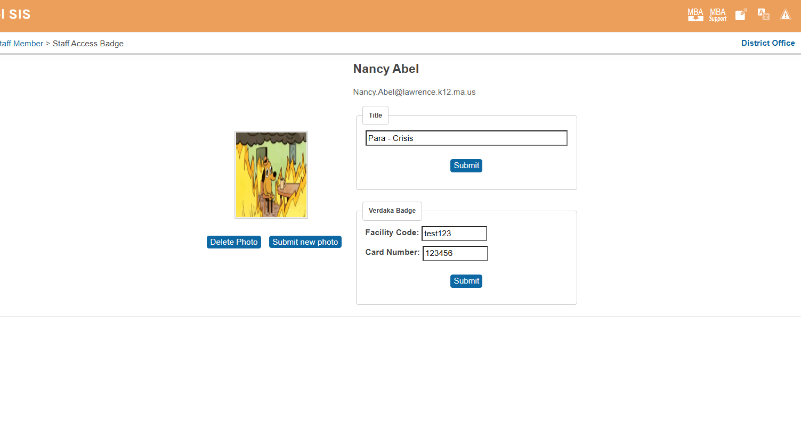
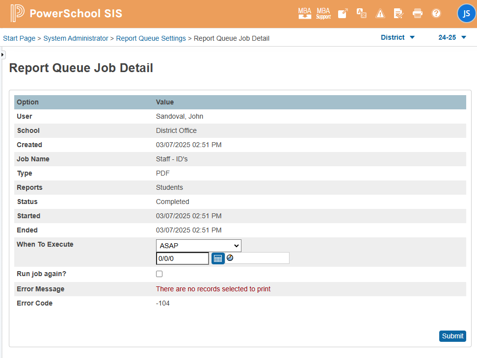
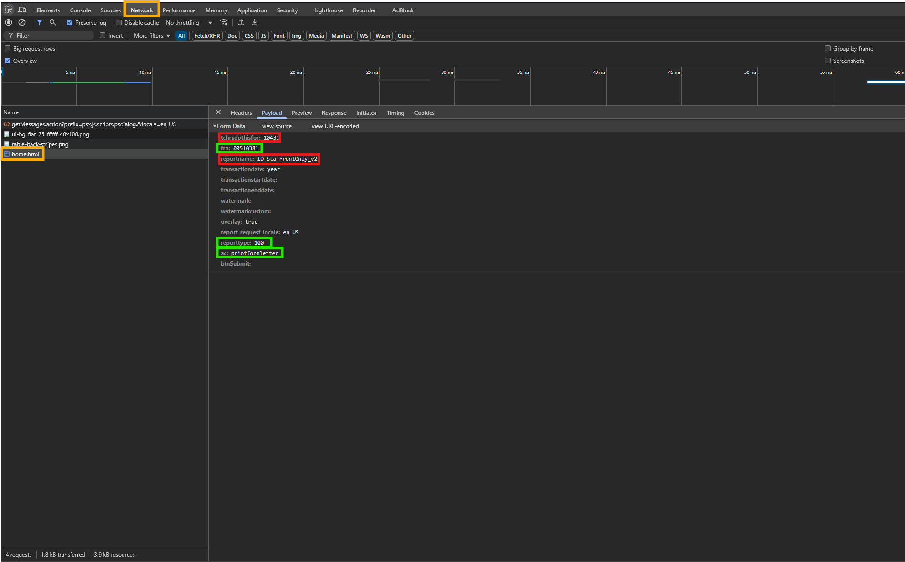

> 📌 Will fill this out when done and in production

## Table of Contents

1. [Issues Encountered](#issues-encountered)
   - [Trouble with `more2.LPSstaffAccessBadge.leftnav.footer.txt`](#trouble-with-more2lpsstaffaccessbadgeleftnavfootertxt)
   - [Issues with Displaying Teacher Information](#issues-with-displaying-teacher-information)
   - [Trouble with the Homeschool](#trouble-with-the-homeschool)
2. [Concepts Learned](#concepts-learned)
   - [Creating a New Table Extension](#creating-a-new-table-extension)
   - [Writing to the Database](#writing-to-the-database)
   - [Editing an Existing Table](#editing-an-existing-table)
3. [Conclusion](#conclusion)

## Issues Encountered

### Trouble with `more2.LPSstaffAccessBadge.leftnav.footer.txt`

#### Student Version:

```javascript
<script type="text/javascript">
$j(document).ready(function() {
     $j("ul#std_information > li > a[href^='state/stateMA.html?frn=']").parent().after($j('<li><a href="LPS-earlycollege.html?frn=~(frn)">State Early College &tilde;</a></li>'));
});
</script>
```

#### Teacher Version:

```javascript
<script type="text/javascript">
$j(document).ready(function() {
     $j("ul#tchr_information > li > a[href^='photo.html?frn=']").parent().after($j('<li><a href="LPS-StaffAccessBadge.html?frn=~(frn)">Staff Access Badge</a></li>'));
});
</script>
```

The script was not targeting the correct list due to the difference between `#std_information` and `#tchr_information`.

### Issues with Displaying Teacher Information

The information page for the teacher's name, email address, homeschool, and title was not displaying correctly. The input fields were not being removed.

#### Script Used:

```javascript
// Extract values from inputs and replace them with text
const firstName = $j("#firstName").val();
const lastName = $j("#lastName").val();
const title = $j("#title").val(); // This eventually gets deleted due to needing to edit the title
const email = $j("#email_address").val();

$j("#firstName").replaceWith(`<span class="name">${firstName}</span>`);
$j("#lastName").replaceWith(`<span class="name">${lastName}</span>`);
$j("#title").replaceWith(`<span class="title">${title}</span>`); // Also gets deleted
$j("#email_address").replaceWith(`<span class="email">${email}</span>`);
```

This script allowed extraction of values from the input fields and displayed the teacher's name, email address, homeschool, and title on the page.

### Trouble with the Homeschool

The homeschool is a dropdown menu by default. The selected option needed to be displayed on the page and ensure the user viewing the page has access to the information.

#### Script Used:

```javascript
// Display the selected option from the dropdown menu
$j(document).ready(function () {
  if ($j("#homeschoolSelect option:selected").text() === "*****")
    $j("#homeschool").html(
      "<font size='-1' face='Verdana,Geneva,Arial,Helvetica,sans-serif'>*****</font>"
    );
  else $j("#homeschool").html($j("#homeschoolSelect option:selected").text());
});
```

#### HTML:

```html
<tr>
  <td id="homeschool"></td>
</tr>
<tr>
  <td>
    ~[if.isrestrictedbyerp]
    <!-- If the user is restricted by ERP -->
    <input
      type="text"
      name="[05]email_addr"
      value=""
      size="50"
      id="email_address"
      disabled="disabled"
    />
    [else]
    <!-- If the user is not restricted by ERP -->
    <input
      type="text"
      name="[05]email_addr"
      value=""
      size="50"
      id="email_address"
      aria-required="true"
    />
    [/if]
  </td>
</tr>
```

## Concepts Learned

### Creating a New Table Extension

To create a new "table extension" in the Powerschool database, I created a new table extension called "U_STAFF_VERKADA".

1. Go to Start Page > System Administrator > Page and Data Management > Manage Database Extensions.
2. Select the table you want to extend (in this case, the "SchoolStaff" table) and click "Add Extension".
3. I named the extension "U_STAFF_VERKADA" and added fields called "facilitycode" and "cardnumber".

### Writing to the Database

To write to the database, I created a form on our page that would allow the user to input the facility code and card number.

```html
<!-- Verkada Badge form -->
<form action="LPS-StaffAccessBadge.html?frn=~(frn)" method="POST">
  <fieldset>
    <legend>Verkada Badge</legend>
    <table border="0" cellspacing="0" cellpadding="4">
      <tr>
        <td>
          <!-- Following the [table.extension]field format -->
          <label for="facilityCode">Facility Code:</label>
          <input
            type="text"
            name="[SCHOOLSTAFF.U_STAFF_VERKADA]facilitycode"
            id="facilityCode"
            value=""
            size="10"
          />
        </td>
      </tr>
      <tr>
        <td>
          <!-- Following the [table.extension]field format -->
          <label for="cardNumber">Card Number:</label>
          <input
            type="text"
            name="[SCHOOLSTAFF.U_STAFF_VERKADA]cardnumber"
            id="cardNumber"
            value=""
            size="10"
          />
        </td>
      </tr>
      <tr>
        <td style="text-align: center;">
          <div
            class="button-row"
            style="display: flex; justify-content: center;"
          >
            <!-- This is the submit button, done the way Powerschool likes it -->
            <input type="hidden" name="ac" value="prim" />
            ~[submitbutton]
          </div>
        </td>
      </tr>
    </table>
  </fieldset>
</form>
```

### Editing an Existing Table

Start Page > System Administrator > Page and Data Management > Data Export Manager
To make the title editable, I created a form modeled after the Verkada form. The title is stored in the "TEACHERS" table under the "title" field.

```html
<!-- Title and form -->
<form action="LPS-StaffAccessBadge.html?frn=~(frn)" method="POST">
  <fieldset>
    <legend>Title</legend>
    <table border="0" cellspacing="0" cellpadding="4">
      <tr>
        <td>
          <!-- Following the [table.extension]field format -->
          <input
            type="text"
            name="[TEACHERS]title"
            value=""
            size="42"
            id="title"
          />
        </td>
      </tr>
      <td style="text-align: center;">
        <div class="button-row" style="display: flex; justify-content: center;">
          <!-- This is the submit button, done the way Powerschool likes it -->
          <input type="hidden" name="ac" value="prim" />
          ~[submitbutton]
        </div>
      </td>
    </table>
  </fieldset>
</form>
```

<!-- Section about picture uploads -->
<!-- Inserting pics in webroot to admin folder and bluesteel -->

<!-- Section about combing forms onto one and struggling with  -->
<!-- <input type="hidden" name="ac" value="prim"> -->
<!-- to combine forms and AC -->

## Conclusion

This is the (current 3/4/25) result of the page:



Contact me if you have any questions or need help with anything at [john.sandoval@lawrence.k12.ma.us](mailto:john.sandoval@lawrence.k12.ma.us).

# ADD ALL THIS EVENTUALLY:

Worked with logan on getting the print badge button to work to take the user directly to the page print report que

I got the form to do this working pretty quickly with this code:

```javascript
<form id="printBadgeForm" action="/admin/reportqueue/home.html" method="POST"
    style="text-align: center; margin-top: 10px;">
    <table>
        <tr>
            <td class="bold">
                ~[text:psx.html.admin_facultylist.printformletters.which_report_would_you_like_to_print]
            </td>
            <td>~[x:reportlist;type=100,500]</td>
        </tr>
    </table>
    <input type="hidden" name="reporttype" value="100"> <!-- 100 is the file type for PDF -->
    <input type="hidden" name="ac" value="printformletter">
    <input type="hidden" name="staffID" value="~(frn)">
    <input type="hidden" name="reportname" id="reportname" value="">
    <button type="submit" class="custom-file-upload">Print Badge</button>
</form>
```

It would submit into the que system but with these errors:


thus, it would not succesfully generate the PDF.

Logan looked into this with me and using the brower tools we were able to see the input fields the _PowerSchool Dynamic Form_ was submitting. I had what is in reen but was missing what is in red:



This would explain why I was getting the "There are no records selected to print" error. The missing field:

```html
<input type="hidden" name="tchrsdothisfor" value="10431" />
```

indicates that we want to print for only one record and that the record is the one we are currently viewing.

Now, the form looks like this:

```html
<form
  id="printBadgeForm"
  action="/admin/reportqueue/home.html"
  method="POST"
  style="text-align: center; margin-top: 10px;"
>
  <table style="display:none;">
    <tr>
      <td class="bold">
        ~[text:psx.html.admin_facultylist.printformletters.which_report_would_you_like_to_print]
      </td>
      <td>~[x:reportlist;type=100,500]</td>
    </tr>
  </table>
  <input type="hidden" name="tchrsdothisfor" value="10431" />
  <input type="hidden" name="staffID" value="~(frn)" />
  <input type="hidden" name="reporttype" value="100" />
  <input type="hidden" name="ac" value="printformletter" />
  <button type="submit" class="custom-file-upload">Print Badge</button>
</form>
```

Now, the form submits correctly and generates the PDF. I also made a script so that the form would automatically submit as a "Staff ID" badge:

```javascript
document.addEventListener("DOMContentLoaded", function () {
  const reportSelect = document.querySelector('select[name="reportname"]');
  if (reportSelect) {
    reportSelect.value = "Staff - ID's";
  }
});
```

This makes it nice anc clean so the user only has to click the button and the badge will be generated.