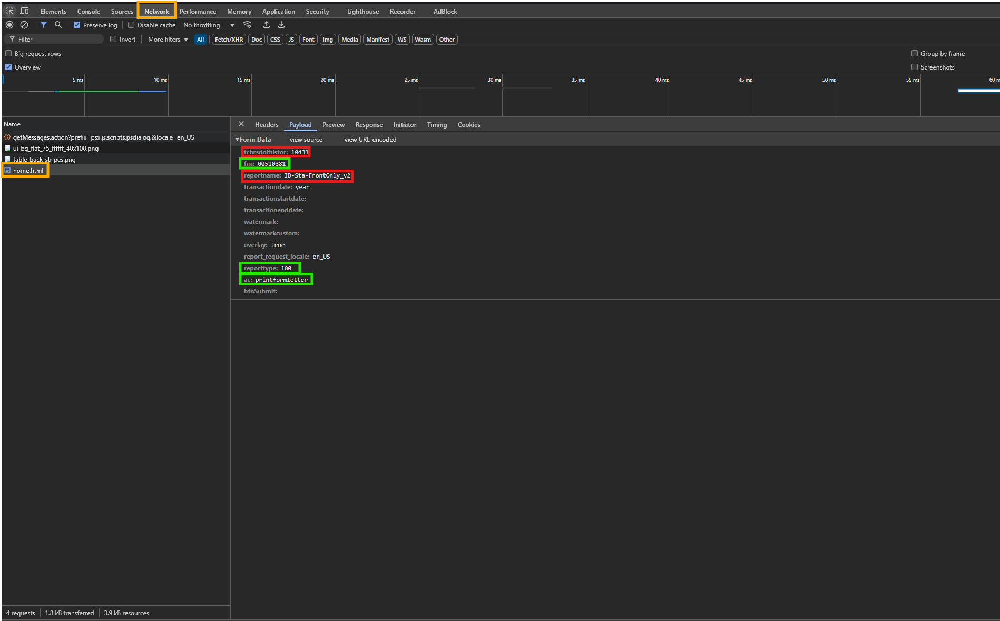

> 📌 This project was a significant learning experience. I gained a deeper understanding of how PowerSchool interprets data and handles scripting. I faced numerous challenges and experimented with adding modern features such as image previews and state-based UI. 

# LPS-StaffAccessBadge

## Table of Contents

1. [Issues Encountered](#issues-encountered)
   - [Trouble with `more2.LPSstaffAccessBadge.leftnav.footer.txt`](#trouble-with-more2lpsstaffaccessbadgeleftnavfootertxt)
   - [Issues with Displaying Teacher Information](#issues-with-displaying-teacher-information)
   - [Trouble with the Homeschool](#trouble-with-the-homeschool)
   - [Getting the Print Feature to Work](#getting-the-print-feature-to-work)
   - [Combining Two Forms into One](#combining-two-forms-into-one)
2. [Concepts Learned](#concepts-learned)
   - [Creating a New Table Extension](#creating-a-new-table-extension)
   - [Writing to the Database](#writing-to-the-database)
   - [Editing an Existing Table](#editing-an-existing-table)
   - [Uploading a Photo](#uploading-a-photo)
   - [Inserting Hardcoded Pictures onto the HTML Page](#inserting-hardcoded-pictures-onto-the-html-page)
   - [Disabling the Print Button if Changes Are Not Saved](#disabling-the-print-button-if-changes-are-not-saved)
3. [Conclusion](#conclusion)

## Issues Encountered

### Trouble with `more2.LPSstaffAccessBadge.leftnav.footer.txt`

The script was not targeting the correct list due to the difference between `#std_information` and `#tchr_information`.

#### Student Version:

```javascript
<script type="text/javascript">
$j(document).ready(function() {
     $j("ul#std_information > li > a[href^='state/stateMA.html?frn=']").parent().after($j('<li><a href="LPS-earlycollege.html?frn=~(frn)">State Early College &tilde;</a></li>'));
});
</script>
```

#### Teacher Version:

```javascript
<script type="text/javascript">
$j(document).ready(function() {
     $j("ul#tchr_information > li > a[href^='photo.html?frn=']").parent().after($j('<li><a href="LPS-StaffAccessBadge.html?frn=~(frn)">Staff Access Badge</a></li>'));
});
</script>
```

### Issues with Displaying Teacher Information

The information page for the teacher's name, email address, homeschool, and title was not displaying correctly. The input fields were not being removed.

#### Script Used:

```javascript
// Extract values from inputs and replace them with text
const firstName = $j("#firstName").val();
const lastName = $j("#lastName").val();
const title = $j("#title").val(); // This eventually gets deleted due to needing to edit the title
const email = $j("#email_address").val();

$j("#firstName").replaceWith(`<span class="name">${firstName}</span>`);
$j("#lastName").replaceWith(`<span class="name">${lastName}</span>`);
$j("#title").replaceWith(`<span class="title">${title}</span>`); // Also gets deleted
$j("#email_address").replaceWith(`<span class="email">${email}</span>`);
```

This script allowed extraction of values from the input fields and displayed the teacher's name, email address, homeschool, and title on the page.

### Trouble with the teahcers "Homeschool"

The homeschool is a dropdown menu by default. The selected option needed to be displayed on the page and ensure the user viewing the page has access to the information.

#### Script Used:

```javascript
// Display the selected option from the dropdown menu
$j(document).ready(function () {
  if ($j("#homeschoolSelect option:selected").text() === "*****")
    $j("#homeschool").html(
      "<font size='-1' face='Verdana,Geneva,Arial,Helvetica,sans-serif'>*****</font>"
    );
  else $j("#homeschool").html($j("#homeschoolSelect option:selected").text());
});
```

#### HTML:

```html
<tr>
  <td id="homeschool"></td>
</tr>
<tr>
  <td>
    ~[if.isrestrictedbyerp]
    <!-- If the user is restricted by ERP -->
    <input
      type="text"
      name="[05]email_addr"
      value=""
      size="50"
      id="email_address"
      disabled="disabled"
    />
    [else]
    <!-- If the user is not restricted by ERP -->
    <input
      type="text"
      name="[05]email_addr"
      value=""
      size="50"
      id="email_address"
      aria-required="true"
    />
    [/if]
  </td>
</tr>
```

### Getting the Print Feature to Work

Worked with Logan on getting the print badge button to work to take the user directly to the page print report queue.

I got the form to start _mostly_ working pretty quickly with this code:

```html
<form
  id="printBadgeForm"
  action="/admin/reportqueue/home.html"
  method="POST"
  style="text-align: center; margin-top: 10px;"
>
  <table>
    <tr>
      <td class="bold">
        <!-- This is the dropdown list for the report type/name, eventually hidden and auto-selected -->
        ~[text:psx.html.admin_facultylist.printformletters.which_report_would_you_like_to_print]
      </td>
      <td>~[x:reportlist;type=100,500]</td>
    </tr>
  </table>
  <input type="hidden" name="reporttype" value="100" />
  <!-- 100 is the file type for PDF -->
  <input type="hidden" name="ac" value="printformletter" />
  <input type="hidden" name="staffID" value="~(frn)" />
  <input type="hidden" name="reportname" id="reportname" value="" />
  <button type="submit" class="custom-file-upload">Print Badge</button>
</form>
```

![alt text](images/image-3.pngq

It would submit into the queue system but with the errors of:

- No record selected to print
- Would think it was in the students group

Thus, it would not successfully generate the PDF.

Logan looked into this with me and using the browser tools we were able to see the input fields the _PowerSchool Dynamic Form_ was submitting. I had what is in green but was missing what is in red:

- tchrsdothisfor
- reportname



This would explain why I was getting the "There are no records selected to print" error. The missing field:

```html
<input type="hidden" name="tchrsdothisfor" value="10431" />
```

indicates that we want to print for only one record and that the record is the one we are currently viewing.

Now, the form looks like this:

```html
<form
  id="printBadgeForm"
  action="/admin/reportqueue/home.html"
  method="POST"
  style="text-align: center; margin-top: 10px;"
>
  <table style="display:none;">
    <tr>
      <td class="bold">
        ~[text:psx.html.admin_facultylist.printformletters.which_report_would_you_like_to_print]
      </td>
      <td>~[x:reportlist;type=100,500]</td>
    </tr>
  </table>
  <input type="hidden" name="tchrsdothisfor" value="10431" />
  <input type="hidden" name="staffID" value="~(frn)" />
  <input type="hidden" name="reporttype" value="100" />
  <input type="hidden" name="ac" value="printformletter" />
  <button type="submit" class="custom-file-upload">Print Badge</button>
</form>
```

Now, the form submits correctly to the teachers group.

As far as the name goes, I was able to set the default value of the report name to "Staff - ID's" with this code:

```javascript
document.addEventListener("DOMContentLoaded", function () {
  const reportSelect = document.querySelector('select[name="reportname"]');
  if (reportSelect) {
    reportSelect.value = "Staff - ID's";
  }
});
```

With these changes, the print badge button now works as expected, generating a PDF that defaults to the double-sided badge card report.

### Combining Two Forms into One

I was asked to combine the Verkada Badge form and the Title form into one form. The issue was that each form had its own `ac` value that was being submitted. I needed to combine the forms and have only one `ac` value submitted.

#### Original Forms (Verkada Badge and Title)

```html
<form action="example1.html" method="POST">
  <input type="text" name="field1" value="" />
  <input type="hidden" name="ac" value="prim" />
  <input type="submit" value="Submit" />
</form>

<form action="example2.html" method="POST">
  <input type="text" name="field2" value="" />
  <input type="hidden" name="ac" value="prim" />
  <input type="submit" value="Submit" />
</form>
```

#### Combined Form with Errors

```html
<form action="example1.html" method="POST">
  <input type="text" name="field1" value="" />
  <input type="hidden" name="ac" value="prim" />
  <input type="text" name="field2" value="" />
  <input type="hidden" name="ac" value="prim" />
  <input type="submit" value="Submit" />
</form>
```

#### Combined Form with Solution

```html
<form action="example1.html" method="POST">
  <input type="text" name="field1" value="" />
  <input type="text" name="field2" value="" />
  <!-- Only one ac value, so the form is submitting its data once -->
  <input type="hidden" name="ac" value="prim" />
  <input type="submit" value="Submit" />
</form>
```

## Concepts Learned

### Creating a New Table Extension

To create a new "table extension" in the Powerschool database, I created a new table extension called "U_STAFF_VERKADA".

1. Navigate to **Start Page** > **System Administrator** > **Page and Data Management** > **Manage Database Extensions**.
2. Select the table you want to extend (in this case, the **SchoolStaff** table) and click **Add Extension**.
3. Name the extension `U_STAFF_VERKADA` and add fields called `facilitycode` and `cardnumber`.

### Writing to the Database

To write to the database, I created a form on our page that would allow the user to input the `facility code` and `card number`.

```html
<!-- Verkada Badge form -->
<form action="LPS-StaffAccessBadge.html?frn=~(frn)" method="POST">
  <fieldset>
    <legend>Verkada Badge</legend>
    <table border="0" cellspacing="0" cellpadding="4">
      <tr>
        <td>
          <!-- Following the [table.extension]field format -->
          <!-- The [SCHOOLSTAFF.U_STAFF_VERKADA] is the table extension -->
          <!-- The facilitycode and cardnumber are the fields in the extension we are writing/reading -->
          <label for="facilityCode">Facility Code:</label>
          <input
            type="text"
            name="[SCHOOLSTAFF.U_STAFF_VERKADA]facilitycode"
            id="facilityCode"
            value=""
            size="10"
          />
        </td>
      </tr>
      <tr>
        <td>
          <label for="cardNumber">Card Number:</label>
          <input
            type="text"
            name="[SCHOOLSTAFF.U_STAFF_VERKADA]cardnumber"
            id="cardNumber"
            value=""
            size="10"
          />
        </td>
      </tr>
      <tr>
        <td style="text-align: center;">
          <div
            class="button-row"
            style="display: flex; justify-content: center;"
          >
            <input type="hidden" name="ac" value="prim" />
            ~[submitbutton]
          </div>
        </td>
      </tr>
    </table>
  </fieldset>
</form>
```

### Editing an Existing Table

To make the title editable, I built a form based off of the Verkada form I created. The title is stored in the `TEACHERS` table under the `title` field.

1. Navigate to **Start Page** > **System Administrator** > **Page and Data Management** > **Data Export Manager**.
2. The form is similar to the Verkada form, but with the `TEACHERS` table and `title` field.

```html
<form action="LPS-StaffAccessBadge.html?frn=~(frn)" method="POST">
  <fieldset>
    <legend>Title</legend>
    <table border="0" cellspacing="0" cellpadding="4">
      <tr>
        <td>
          <input
            type="text"
            name="[TEACHERS]title"
            value=""
            size="42"
            id="title"
          />
        </td>
      </tr>
      <td style="text-align: center;">
        <div class="button-row" style="display: flex; justify-content: center;">
          <input type="hidden" name="ac" value="prim" />
          ~[submitbutton]
        </div>
      </td>
    </table>
  </fieldset>
</form>
```

### Uploading a Photo

I had not done a photo upload from an OS in a while, so it was good to use it again in a real-world scenario and see how users interact with it. This was done by making an input that only accepts images and then submitting the form to the same page with the image data. This was very different from the Verkada and Title forms, which were just text inputs. Those targeted a table extension and a table field, while the image upload targeted the file input and the form action.

#### HTML Form for Image Upload

```html
<form
  action="LPS-StaffAccessBadge.html?frn=~(frn)"
  method="POST"
  enctype="multipart/form-data"
  style="margin: 0;"
>
  <label
    for="fileInput"
    class="custom-file-upload"
    id="chooseFileLabel"
    style="margin: 0;"
  >
    Choose a file
  </label>
  <input
    type="file"
    name="filename"
    accept="image/*"
    required
    id="fileInput"
    style="margin: 0;"
  />
  <div class="button-row" style="margin: 0;">
    <input type="hidden" name="ac" value="submitteacherphoto" />
    <input type="hidden" name="frn" value="~(frn)" />
    <input type="hidden" name="curtchrid" value="~(curtchrid)" />
    <button
      type="submit"
      id="submitButton"
      class="custom-file-upload"
      style="margin-bottom: 10px; margin-left: 0; margin-right: 0;"
    >
      Confirm upload
    </button>
  </div>
</form>
```

#### Image Preview Section

To enhance the user experience, I added a _conditional_ picture preview to the page so the user could see the image they were about to upload.

```html
<!-- Image preview section -->
<div id="imagePreview">
  
  <p><i>Preview of new picture</i></p>
</div>
```

#### JavaScript for Image Preview

The script updates the image source when a file is selected. It also hides the submit button and image preview if no file is selected and shows them if a file is selected. The choose file label is hidden if a file is selected to give the user a cleaner and less confusing experience.

```javascript
// Handle file input change event
document.getElementById("fileInput").addEventListener("change", function () {
  const submitButton = document.getElementById("submitButton");
  const chooseFileLabel = document.getElementById("chooseFileLabel");
  const imagePreview = document.getElementById("imagePreview");
  const previewImg = document.getElementById("previewImg");

  // If a file is selected, show the submit button and image preview
  if (this.files.length > 0) {
    submitButton.style.display = "inline-block";
    chooseFileLabel.style.display = "none";
    imagePreview.style.display = "block";

    // Read the file data as a URL and set it as the image source
    const reader = new FileReader();
    reader.onload = function (e) {
      previewImg.src = e.target.result;
    };
    reader.readAsDataURL(this.files[0]);
  } else {
    // If no file is selected, hide the submit button and image preview
    submitButton.style.display = "none";
    chooseFileLabel.style.display = "inline-block";
    imagePreview.style.display = "none";
    previewImg.src = "#";
  }
});
```

### Inserting Hardcoded Pictures onto the HTML Page

Inserting a picture on a PowerSchool page was a new challenge. Initially, I tried using the `img` tag with the `src` attribute pointing to the image in the same directory, but that did not work. The solution was to place the image inside an "images" folder within the "admin" folder in the webroot. This approach helped me understand how PowerSchool handles plugins and organizes files in the webroot (It merges all photos across plugins into one folder).

Here is the directory structure:

```
LPS-StaffAccessBadge/
└── WEB_ROOT/
  └── admin/
    ├── images/
    │   └── VerkadaBadge.jpg
    └── faculty/
      ├── LPS-StaffAccessBadge.css
      ├── LPS-StaffAccessBadge.html
      ├── LPS-StaffAccessBadge.js
      └── more2.LPSStaffAccessBadge.leftnav.footer.txt
```

To display the image on the HTML page, use the following code:

```html

```

This method ensures that the image is correctly referenced and displayed on the PowerSchool page.

<!-- Disable print button if changes are not saved Image preview when submitting -->

### Disabling the Print Button if Changes Are Not Saved

To prevent users from printing the badge without saving changes, I disabled the print button and displayed a message to save changes before printing. I also showed the original values of the title, facility code, and card number if changes were made. This was a more complex JavaScript function that required checking multiple input fields and comparing them to their initial values. However, it provided a better user experience by preventing users from accidentally printing the badge without saving changes.

```javascript
// Select the "Print Badge" button and the message element
const printBadgeButton = document.querySelector(
  '#printBadgeForm button[type="submit"]'
);
const printBadgeMessage = document.getElementById("printBadgeMessage");

// Select the input fields for title, facility code, and card number
const titleInput = document.getElementById("title");
const facilityCodeInput = document.getElementById("facilityCode");
const cardNumberInput = document.getElementById("cardNumber");

// Store the initial values of the input fields
const initialTitle = titleInput.value;
const initialFacilityCode = facilityCodeInput.value;
const initialCardNumber = cardNumberInput.value;

// Select the elements to display the original values
const originalTitle = document.getElementById("originalTitle");
const originalFacilityCode = document.getElementById("originalFacilityCode");
const originalCardNumber = document.getElementById("originalCardNumber");

// Set the text content of the original value elements
originalTitle.textContent = `Original: ${initialTitle}`;
originalFacilityCode.textContent = `Original: ${initialFacilityCode}`;
originalCardNumber.textContent = `Original: ${initialCardNumber}`;

// Function to check for changes in the input fields
function checkForChanges() {
  // If any input field value has changed
  if (
    titleInput.value !== initialTitle ||
    facilityCodeInput.value !== initialFacilityCode ||
    cardNumberInput.value !== initialCardNumber
  ) {
    // Disable the "Print Badge" button and show the message
    printBadgeButton.disabled = true;
    printBadgeMessage.style.display = "block";

    // Show or hide the original value elements based on changes
    if (titleInput.value !== initialTitle) {
      originalTitle.style.display = "block";
    } else {
      originalTitle.style.display = "none";
    }

    if (facilityCodeInput.value !== initialFacilityCode) {
      originalFacilityCode.style.display = "block";
    } else {
      originalFacilityCode.style.display = "none";
    }

    if (cardNumberInput.value !== initialCardNumber) {
      originalCardNumber.style.display = "block";
    } else {
      originalCardNumber.style.display = "none";
    }
  } else {
    // Enable the "Print Badge" button and hide the message
    printBadgeButton.disabled = false;
    printBadgeMessage.style.display = "none";
    originalTitle.style.display = "none";
    originalFacilityCode.style.display = "none";
    originalCardNumber.style.display = "none";
  }
}
```

## Conclusion

If you have any questions or need help with anything at [john.sandoval@lawrence.k12.ma.us](mailto:john.sandoval@lawrence.k12.ma.us).
